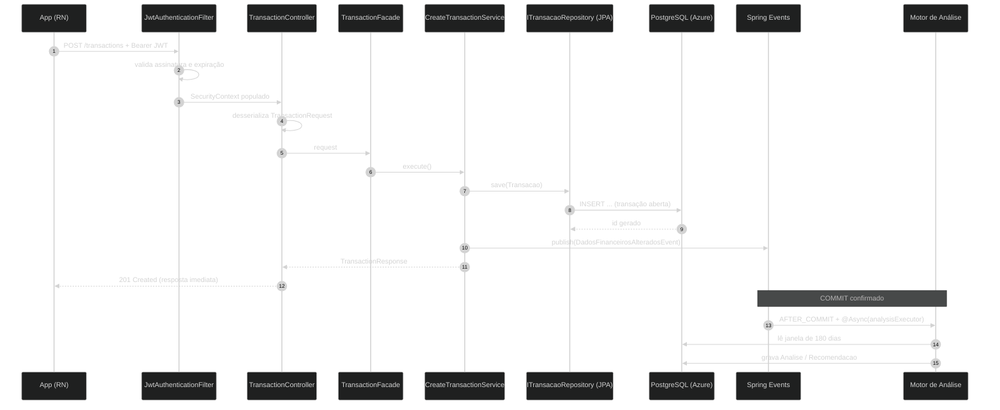
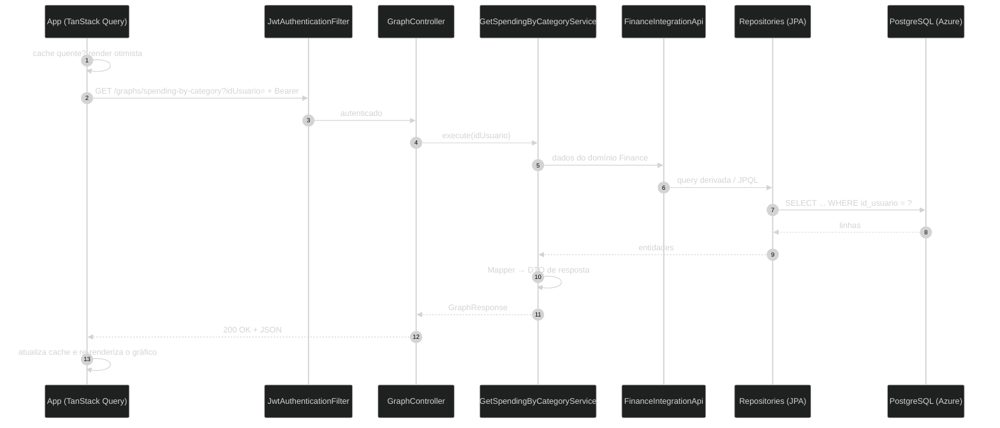
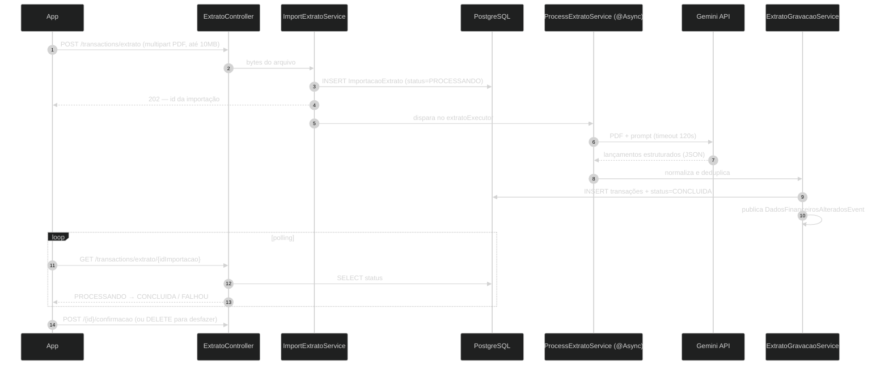

# Fluxo técnico de acesso aos dados (app ↔ nuvem)

> Atualizado em 2026-09-16. Três fluxos reais do sistema, na ordem em que são
> demonstrados no pitch: **gravação**, **leitura** e **gravação assíncrona com IA**.

## 1. Request de GRAVAÇÃO — `POST /transactions`

Pontos técnicos: o evento só dispara **depois do commit** (rollback não gera
análise sobre lançamento inexistente) e roda em **pool separado do Tomcat**, então
o usuário recebe o 201 sem esperar o recálculo.

## 2. Request de LEITURA — `GET /graphs/spending-by-category`

Ponto técnico: Graphs **não lê tabela de outro domínio** — pede pela
`FinanceIntegrationApi` / `AnalysisIntegrationApi`. Trocar a implementação de um
domínio não quebra os outros.

## 3. Gravação assíncrona com IA — importação de extrato

Ponto técnico: o status é **persistido**, não guardado em memória — o usuário pode
fechar o app e, ao voltar, a tela sabe em que pé está a importação. E a importação
é reversível: `DELETE /transactions/extrato/{id}` desfaz o lote inteiro.
