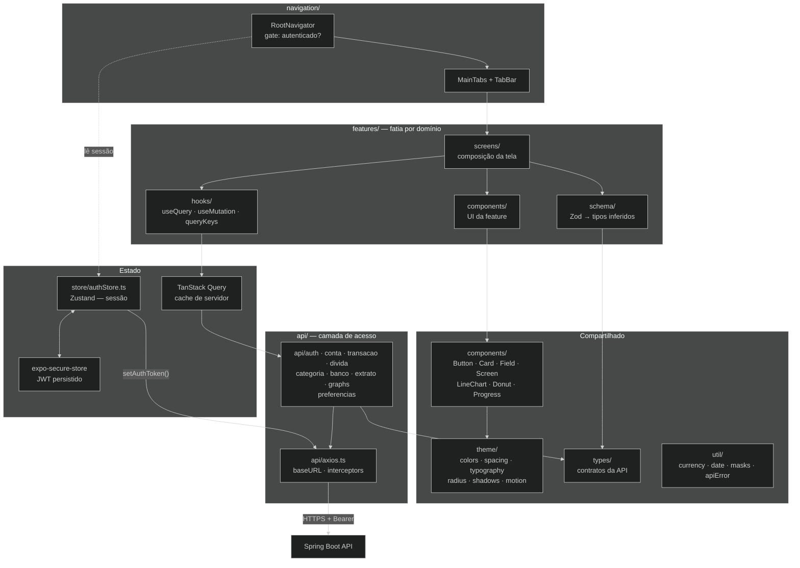
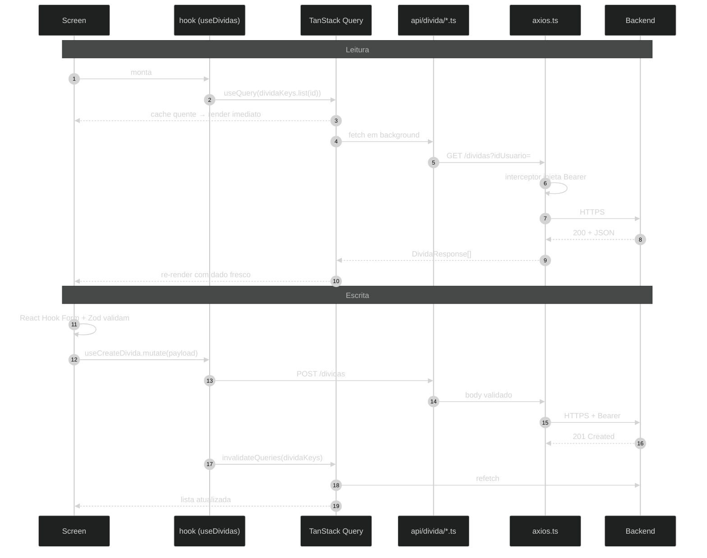
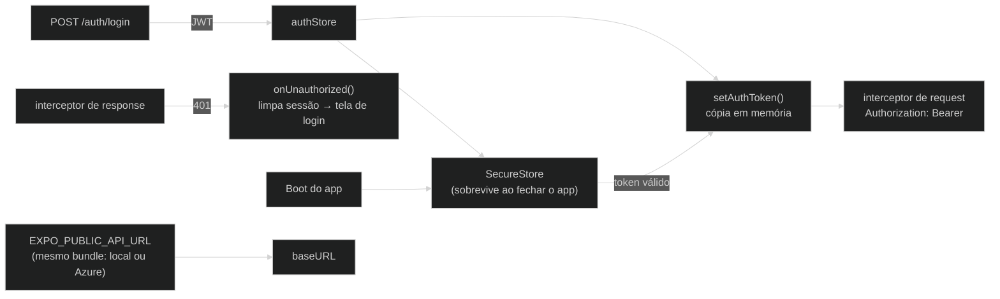

# Arquitetura — Front-end (visão atual)

> Atualizado em 2026-09-16 a partir do código em `TolevFront/src/`.
> Stack: **Expo 57 · React Native 0.86 · React 19 · TypeScript · NativeWind 4 ·
> React Navigation 7 · TanStack Query 5 · Zustand 5 · Axios · React Hook Form + Zod ·
> Reanimated 4 / Moti · Lucide · Gifted Charts · Expo Secure Store**.

## 1. Camadas

**Regras que o desenho impõe**

- Nenhuma tela chama `axios` direto: passa sempre por `api/<recurso>/<operação>.ts`.
- Estado de servidor vive no TanStack Query; o Zustand guarda só sessão.
- Nada de cor/espaçamento hardcoded: tudo sai de `theme/` via NativeWind.

## 2. Ciclo de uma tela (leitura e escrita)

## 3. Sessão e resiliência

