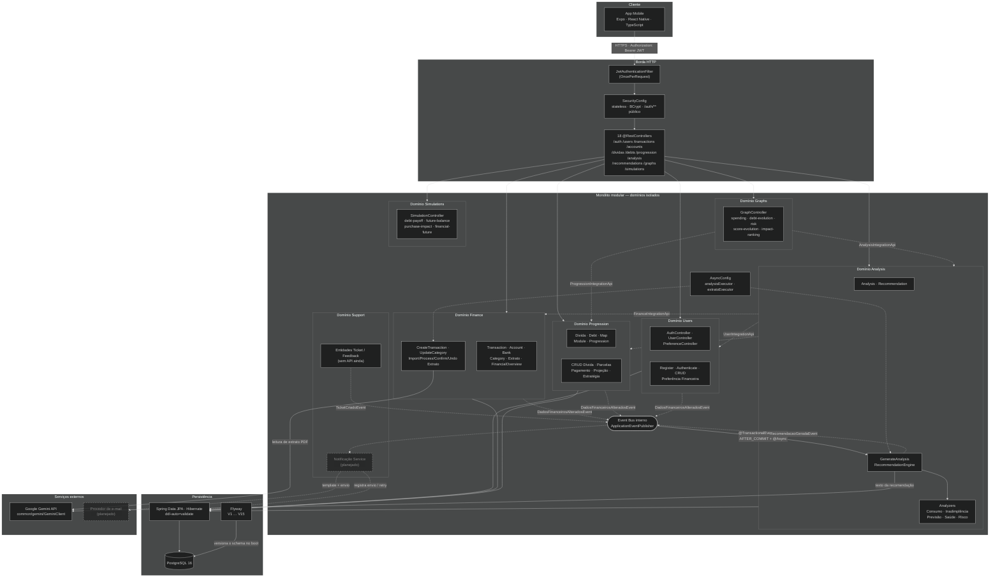
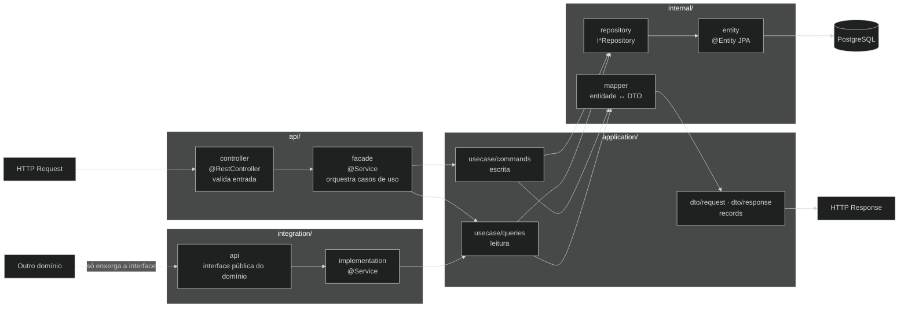
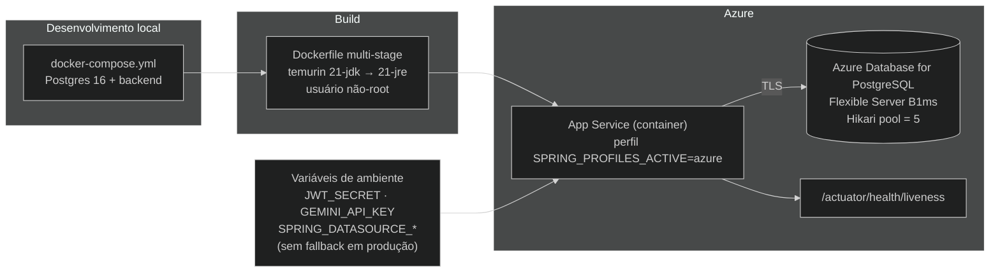

# Arquitetura — Backend (visão atual)

> Atualizado em 2026-09-16 a partir do código em `tolevBack/`.
> Stack: **Java 21 · Spring Boot 3.5.0 · PostgreSQL 16 · Flyway · Docker**.
> Comunicação entre domínios: **integration APIs** (chamada direta tipada) e
> **Spring Events** (reação assíncrona). Não há acoplamento de banco entre domínios.
>
> **Legenda:** caixas marcadas com *(planejado)* e contorno tracejado estão
> desenhadas e previstas na arquitetura, mas ainda não implementadas no código.

## 1. Visão geral

> O caminho do e-mail (ticket → evento → serviço de notificação → provedor,
> com registro de envio e retry em falha) está detalhado em
> [../sequence/email-sequence.md](../sequence/email-sequence.md).

## 2. Anatomia de um domínio (fatia vertical)

Todo domínio repete a mesma estrutura — o que muda é só a regra de negócio.

## 3. Infraestrutura e deploy

