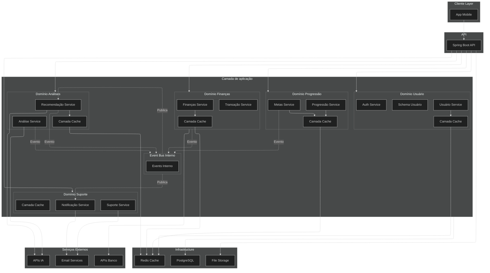

```mermaid
%%{init: {'theme':'dark', 'layout':'elk'}}%%

graph TB

    %% CLIENTE
    subgraph CLIENTE["Cliente Layer"]
        MOBILE["App Mobile"]
    end

    %% API GATEWAY
    subgraph API_LAYER["API"]
        API["Spring Boot API"]
    end

    MOBILE --> API

    subgraph Application["Camada de aplicação"]

    subgraph USER["Domínio Usuário"]
        AUTH["Auth Service"]
        USUARIO["Usuário Service"]
        USER-SCHEMA["Schema Usuário"]   
        CACHE-LAYER-U["Camada Cache"]
    end

    subgraph PROGRESSAO["Domínio Progressão"]
        PROGRESSO["Progressão Service"]
        METAS["Metas Service"]
        CACHE-LAYER-P["Camada Cache"]

    end

    subgraph FINANCAS["Domínio Finanças"]
        FINANCA["Finanças Service"]
        TRANSACTIONS["Transação Service"]
        CACHE-LAYER-F["Camada Cache"]

    end

    subgraph ANALISES["Domínio Análises"]
        ANALISE["Análise Service"]
        RECOMENDACAO["Recomendação Service"]
        CACHE-LAYER-A["Camada Cache"]

    end

    %% SERVICES
    subgraph SUPORTE["Domínio Suporte"]
        TICKET["Suporte Service"]
        NOTIFICACAO["Notificação Service"]
        CACHE-LAYER-S["Camada Cache"]

    end

    subgraph EVENT-BUS["Event Bus Interno"]
            SPRING-EVENTS["Events Interno"]
    end
    end

    API --> USER
    API --> FINANCAS
    API --> ANALISES
    API --> PROGRESSAO 
    API --> SUPORTE
    %% INFRASTRUCTURE
    subgraph INFRA["Infrastructure"]

        DATABASE["PostgreSQL"]
        REDIS["Redis Cache"]
        BLOB_REPO["File Storage"]

    end

    %% EXTERNAL SERVICES
    subgraph EXTERNO["Serviços Externos"]

        API_BANCO["APIs Banco"]
        API_IA["APIs IA"]
        EMAIL["Email Services"]

    end

    %% DATABASE CONNECTIONS
    Application --> DATABASE
    
    %% CACHE CONNECTIONS
    USUARIO --> CACHE-LAYER-U
    METAS --> CACHE-LAYER-P
    PROGRESSO --> CACHE-LAYER-P
    RECOMENDACAO --> CACHE-LAYER-A
    FINANCA --> CACHE-LAYER-F

    CACHE-LAYER-U --> REDIS
    CACHE-LAYER-P --> REDIS
    CACHE-LAYER-A --> REDIS
    CACHE-LAYER-F --> REDIS

    %% STORAGE
    API --> BLOB_REPO

    %% INTERNAL COMMUNICATION

    ANALISE -. Evento .-> EVENT-BUS
    EVENT-BUS -. Publica .-> RECOMENDACAO

    FINANCAS -. Evento .-> EVENT-BUS
    EVENT-BUS -. Publica .-> NOTIFICACAO
    METAS -. Evento .-> EVENT-BUS
    RECOMENDACAO -. Evento .-> EVENT-BUS

    ANALISE --> API_IA
    RECOMENDACAO --> API_IA
    NOTIFICACAO --> EMAIL
    FINANCAS --> API_BANCO
    TICKET --> EMAIL


```