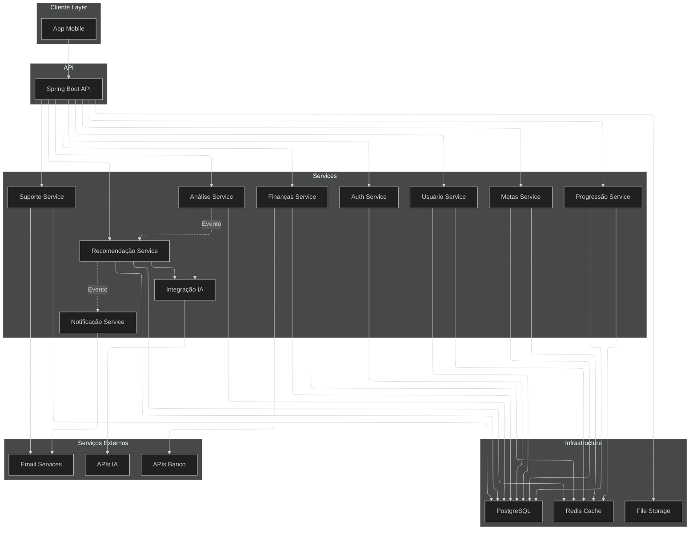

```mermaid
%%{init: {'theme':'dark', 'layout':'elk'}}%%

flowchart TB

    %% CLIENTE
    subgraph CLIENTE["Cliente Layer"]
        MOBILE["App Mobile"]
    end

    %% API GATEWAY
    subgraph API_LAYER["API"]
        API["Spring Boot API"]
    end

    MOBILE --> API

    %% SERVICES
    subgraph CORE["Services"]

        AUTH["Auth Service"]
        USUARIO["Usuário Service"]
        FINANCAS["Finanças Service"]
        ANALISE["Análise Service"]
        RECOMENDACAO["Recomendação Service"]
        METAS["Metas Service"]
        PROGRESSAO["Progressão Service"]
        TICKET["Suporte Service"]

        AI["Integração IA"]
        NOTIFICACAO["Notificação Service"]

    end

    %% API -> SERVICES
    API --> AUTH
    API --> USUARIO
    API --> FINANCAS
    API --> ANALISE
    API --> RECOMENDACAO
    API --> METAS
    API --> PROGRESSAO
    API --> TICKET

    %% INFRASTRUCTURE
    subgraph INFRA["Infrastructure"]

        DATABASE["PostgreSQL"]
        REDIS["Redis Cache"]
        BLOB_REPO["File Storage"]

    end

    %% EXTERNAL SERVICES
    subgraph EXTERNO["Serviços Externos"]

        API_BANCO["APIs Banco"]
        API_IA["APIs IA"]
        EMAIL["Email Services"]

    end

    %% DATABASE CONNECTIONS
    AUTH --> DATABASE
    USUARIO --> DATABASE
    FINANCAS --> DATABASE
    ANALISE --> DATABASE
    RECOMENDACAO --> DATABASE
    METAS --> DATABASE
    PROGRESSAO --> DATABASE
    TICKET --> DATABASE

    %% CACHE CONNECTIONS
    USUARIO --> REDIS
    METAS --> REDIS
    PROGRESSAO --> REDIS
    RECOMENDACAO --> REDIS
    FINANCAS --> REDIS

    %% STORAGE
    API --> BLOB_REPO

    %% INTERNAL COMMUNICATION
    ANALISE --> AI
    RECOMENDACAO --> AI

    ANALISE -. Evento .-> RECOMENDACAO
    RECOMENDACAO -. Evento .-> NOTIFICACAO

    AI --> API_IA
    NOTIFICACAO --> EMAIL
    FINANCAS --> API_BANCO
    TICKET --> EMAIL


```