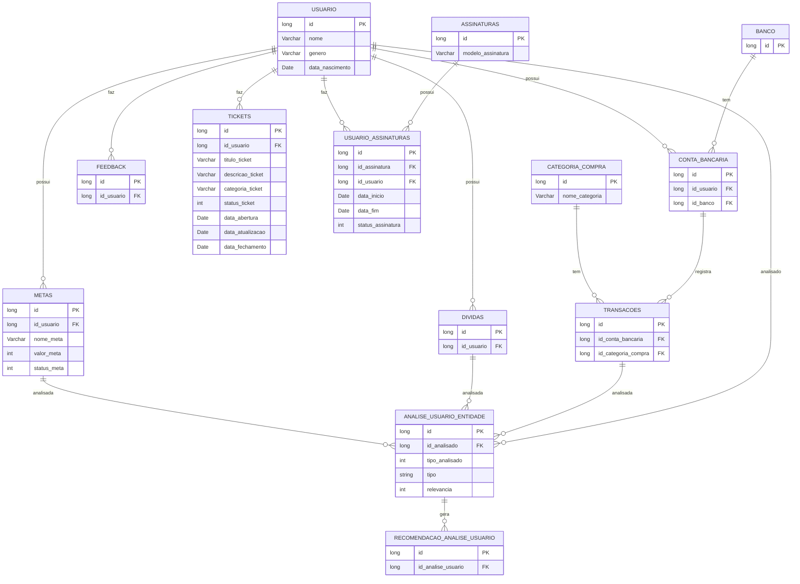

```mermaid
erDiagram
    direction TB

    CONTA_BANCARIA {
        long id PK
        long id_usuario FK
        long id_banco FK
    }

    METAS {
        long id PK
        long id_usuario FK
        Varchar nome_meta
        int valor_meta
        int status_meta
    }

    DIVIDAS {
        long id PK
        long id_usuario FK
    }

    FEEDBACK {
        long id PK
        long id_usuario FK
    }

    BANCO {
        long id PK
    }

    TICKETS {
        long id PK
        long id_usuario FK
        Varchar titulo_ticket
        Varchar descricao_ticket
        Varchar categoria_ticket
        int status_ticket
        Date data_abertura
        Date data_atualizacao
        Date data_fechamento
    }

    USUARIO {
        long id PK
        Varchar nome
        Varchar genero
        Date data_nascimento
    }

    TRANSACOES {
        long id PK
        long id_conta_bancaria FK
        long id_categoria_compra FK
    }

    ANALISE_USUARIO_ENTIDADE {
        long id PK
        long id_analisado FK
        int tipo_analisado
        string tipo
        int relevancia
    }

    RECOMENDACAO_ANALISE_USUARIO {
        long id PK
        long id_analise_usuario FK
    }

    USUARIO_ASSINATURAS {
        long id PK
        long id_assinatura FK
        long id_usuario FK
        Date data_inicio
        Date data_fim
        int status_assinatura
    }

    ASSINATURAS {
        long id PK
        Varchar modelo_assinatura
    }

    CATEGORIA_COMPRA {
        long id PK
        Varchar nome_categoria
    }

    CATEGORIA_COMPRA ||--o{ TRANSACOES : tem

    USUARIO ||--o{ TICKETS : faz
    USUARIO ||--o{ METAS : possui
    USUARIO ||--o{ DIVIDAS : possui
    USUARIO ||--o{ CONTA_BANCARIA : possui
    USUARIO ||--o{ FEEDBACK : faz
    USUARIO ||--o{ USUARIO_ASSINATURAS : faz

    ASSINATURAS ||--o{ USUARIO_ASSINATURAS : possui

    BANCO ||--o{ CONTA_BANCARIA : tem

    CONTA_BANCARIA ||--o{ TRANSACOES : registra

    METAS ||--o{ ANALISE_USUARIO_ENTIDADE : analisada
    DIVIDAS ||--o{ ANALISE_USUARIO_ENTIDADE : analisada
    TRANSACOES ||--o{ ANALISE_USUARIO_ENTIDADE : analisada
    USUARIO ||--o{ ANALISE_USUARIO_ENTIDADE : analisado

    ANALISE_USUARIO_ENTIDADE ||--o{ RECOMENDACAO_ANALISE_USUARIO : gera
```