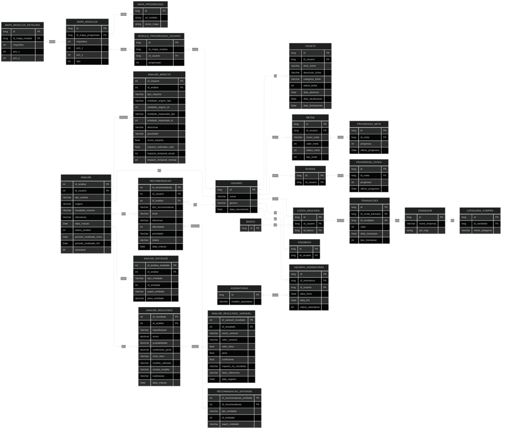

```mermaid
%%{init: {'theme':'dark', 'layout':'elk'}}%%

erDiagram
    direction LR

    USUARIO {
        long id PK
        Varchar nome
        Varchar genero
        Date data_nascimento
    }
    USUARIO ||--o{ TICKETS : "faz"
    USUARIO ||--o{ METAS : "possui"
    USUARIO ||--o{ DIVIDAS : "possui"
    USUARIO ||--o{ CONTA_BANCARIA : "possui"
    USUARIO ||--o{ FEEDBACK : "faz"
    USUARIO ||--o{ USUARIO_ASSINATURAS : "faz"


    METAS {
        long id PK
        long id_usuario FK
        Varchar nome_meta
        int valor_meta
        int status_meta
		int tipo_meta
    }
	METAS||--||PROGRESSO_META : "possui"

	PROGRESSO_META {
		long id PK
		long id_meta FK
		int progresso
		Date ultimo_progresso
	}

    DIVIDAS {
        long id PK
        long id_usuario FK
    }

	DIVIDAS||--||PROGRESSO_DIVIDA : "possui"

	PROGRESSO_DIVIDA {
		long id PK
		long id_meta FK
		int progresso
		Date ultimo_progresso
	}

	MAPA_PROGRESSAO{
		long id PK
		string url_modelo
		string nome_mapa
	}

	MAPA_MODULOS_DETALHES {
		long id PK
		long id_mapa_modulo FK
		int requisitos
		int pos_x
		int pox_y
	}
	MAPA_MODULOS_DETALHES}o--||MAPA_MODULOS : "possui" 

	MAPA_MODULOS {
		long id PK
		long id_mapa_progressao FK
		int requisitos
		int pos_x
		int pox_y
		int tipo
	}
	MAPA_MODULOS}o--||MAPA_PROGRESSAO : "possui" 
	MAPA_MODULOS||--O{MODULO_PROGRESSAO_USUARIO : "possui" 


	MODULO_PROGRESSAO_USUARIO {
		long id PK	
		long id_mapa_modulo
		long id_usuario FK
		int progressao
	}
	MODULO_PROGRESSAO_USUARIO}o--o{USUARIO : "possui" 


    FEEDBACK {
        long id PK
        long id_usuario FK
    }

    CONTA_BANCARIA {
        long id PK
        long id_usuario FK
        long id_banco FK
    }
    CONTA_BANCARIA ||--o{ TRANSACOES : "registra"

    BANCO {
        long id PK
    }
    BANCO ||--o{ CONTA_BANCARIA : "tem"

    TICKETS {
        long id PK
        long id_usuario FK
        Varchar titulo_ticket
        Varchar descricao_ticket
        Varchar categoria_ticket
        int status_ticket
        Date data_abertura
        Date data_atualizacao
        Date data_fechamento
    }

    TRANSACOES {
        long id PK
        long id_conta_bancaria FK
        long id_vendedor FK
		int valor
		Date data_transacao
		int tipo_transacao  
    }
	TRANSACOES}o--||VENDEDOR : "para"

    CATEGORIA_COMPRA {
        long id PK
		long id_vendedor FK
        Varchar nome_categoria
    }
	VENDEDOR ||--o{ CATEGORIA_COMPRA : "tem"

	VENDEDOR {
		long id PK
		Varchar nome_empresa
		string cpf_cnpj
	}

    USUARIO_ASSINATURAS {
        long id PK
        long id_assinatura FK
        long id_usuario FK
        Date data_inicio
        Date data_fim
        int status_assinatura
    }

    
    ASSINATURAS {
        long id PK
        Varchar modelo_assinatura
    }
    ASSINATURAS ||--o{ USUARIO_ASSINATURAS : "possui"


    ANALISE {
        int id_analise PK
        int id_usuario FK
        %%consumo - saude - inadimplencia - previsao - etc
        Varchar tipo_analise
        %% processo que disparou a analise (Talvez enum)
        Varchar origem
        Varchar resultado_resumo
        Varchar relevancia
        Date data_criacao
        int status_analise
        Date periodo_analisado_inicio
        Date periodo_analisado_fim
        bit acionavel
    }
	ANALISE }o--|| USUARIO : "tem"
    ANALISE ||--o{ ANALISE_IMPACTO : "identifica"
    ANALISE ||--o{ RECOMENDACAO : "gera"
    ANALISE ||--o{ ANALISE_ENTIDADE : "possui"
    ANALISE ||--|| ANALISE_RESULTADO : "gera"

    ANALISE_ENTIDADE {
        int id_analise_entidade PK
        int id_analise FK
        Varchar tipo_entidade
        int id_entidade
        Varchar papel_entidade
        %% campo bom para IA
        decimal peso_entidade
    }

    ANALISE_RESULTADO {
        int id_resultado PK
        int id_analise FK
        %% talvez ter uma tabela de classificacao
        Varchar classificacao
        decimal score
        %% probabilidade da analise estar correta
        decimal probabilidade
        %% relação entre variaveis e a resposta
        decimal coeficiente_geral
        Varchar nivel_risco
        %% IA ou Algoritmo ou ambos
        Varchar modelo_utilizado 
        Varchar versao_modelo
        Varchar explicacao
        Date data_criacao
    }
    ANALISE_RESULTADO ||--o{ ANALISE_RESULTADO_VARIAVEL : "detalha"

    ANALISE_RESULTADO_VARIAVEL {
        int id_variavel_resultado PK
        int id_resultado FK
        %% dinamico representa uma variavel da analise
        Varchar nome_variavel
        %% valor do usuário para essa variavel (ex: 45%, acima da media)
        Varchar valor_variavel
        %% valor padrao dessa variavel (ex, 30%)
        float valor_faixa
        float peso
        %% impacto matematica (positivo, negativo)
        float coeficiente
        %% risco aumentado - diminuido - neutro
        Varchar impacto_no_resultado
        %% faixa de referencia normalizada
        Varchar faixa_referencia
        %% registra a ultima verificação dessas analises
        Date data_registro
    }

    ANALISE_IMPACTO {
        int id_impacto PK
        int id_analise FK
         %% financeiro - meta - risco - etc (talvez enum)
        Varchar tipo_impacto
        Varchar entidade_origem_tipo
        int entidade_origem_id
        Varchar entidade_impactada_tipo
        int entidade_impactada_id
        %% humanizado
        Varchar descricao
        %% alta - baixa - etc
        Varchar gravidade
        float score_impacto
        %% ganho ou perca desse impacto
        float impacto_estimado_valor
        int impacto_temporal_anual
        int impacto_temporal_mensal
    }

    RECOMENDACAO {
        int id_recomendacao PK
        int id_usuario FK
        int id_analise FK
        Varchar tipo_recomendacao
        Varchar titulo
        Varchar descricao
        int dificuldade
        Varchar prioridade
        Varchar status
        Date data_criacao
    }
   	RECOMENDACAO ||--o{ RECOMENDACAO_ENTIDADE : "relaciona"
	RECOMENDACAO }o--|| USUARIO : "tem"

    RECOMENDACAO_ENTIDADE {
        int id_recomendacao_entidade PK
        int id_recomendacao FK
        Varchar tipo_entidade
        int id_entidade
        Varchar papel_entidade
    }

  

```