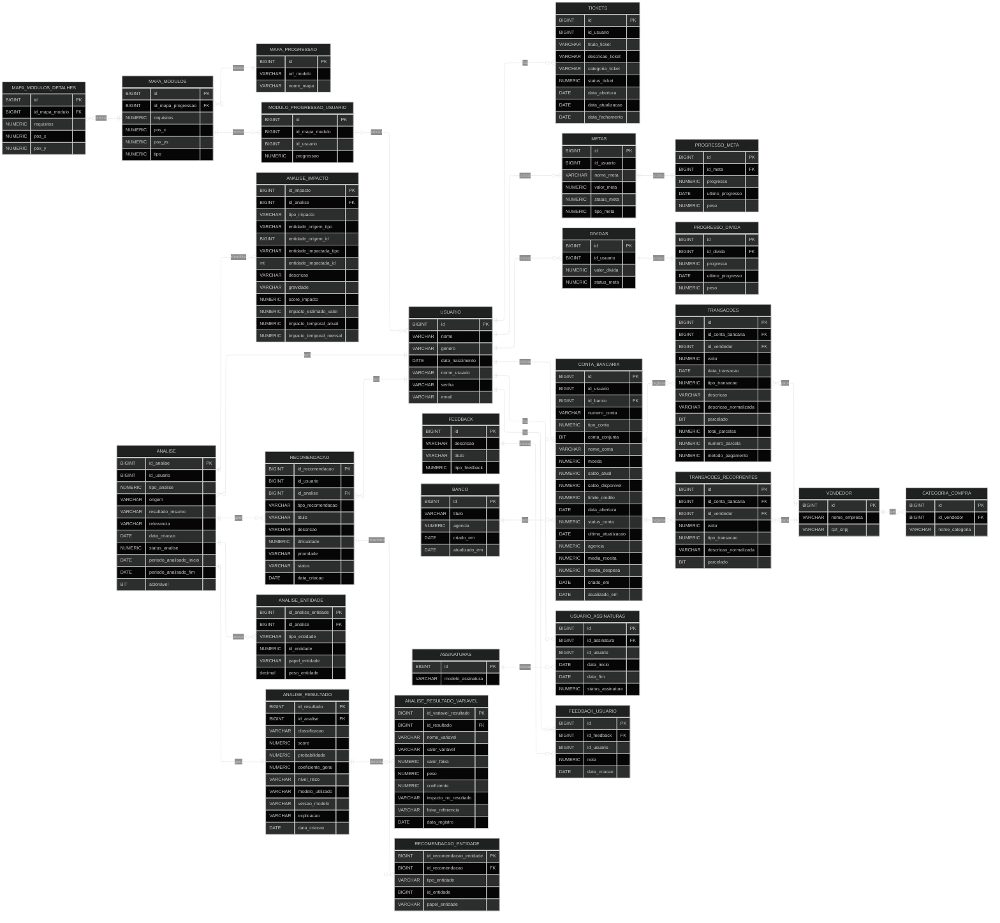

```mermaid
%%{init: {'theme':'dark', 'layout':'elk'}}%%

erDiagram
    direction LR

    USUARIO {
        BIGINT id PK
        VARCHAR nome
        VARCHAR genero
        DATE data_nascimento
        VARCHAR nome_usuario
        VARCHAR senha
        VARCHAR email
    }
    USUARIO ||--o{ TICKETS : "faz"
    USUARIO ||--o{ METAS : "possui"
    USUARIO ||--o{ DIVIDAS : "possui"
    USUARIO ||--o{ CONTA_BANCARIA : "possui"
    USUARIO ||--o{ USUARIO_ASSINATURAS : "faz"
    USUARIO ||--o{ FEEDBACK_USUARIO : "faz"

    METAS {
        BIGINT id PK
        BIGINT id_usuario
        VARCHAR nome_meta
        NUMERIC valor_meta
        %% enum
        NUMERIC status_meta 
        %% enum
		NUMERIC tipo_meta
    }
	METAS||--||PROGRESSO_META : "possui"

	PROGRESSO_META {
		BIGINT id PK
		BIGINT id_meta FK
		NUMERIC progresso
		DATE ultimo_progresso
        NUMERIC peso
	}

    DIVIDAS {
        BIGINT id PK
        BIGINT id_usuario
        NUMERIC valor_divida
        %% enum
        NUMERIC status_meta
    }

	DIVIDAS||--||PROGRESSO_DIVIDA : "possui"

	PROGRESSO_DIVIDA {
		BIGINT id PK
		BIGINT id_divida FK
		NUMERIC progresso
		DATE ultimo_progresso
        NUMERIC peso
	}

	MAPA_PROGRESSAO{
		BIGINT id PK
		VARCHAR url_modelo
		VARCHAR nome_mapa
	}

	MAPA_MODULOS_DETALHES {
		BIGINT id PK
		BIGINT id_mapa_modulo FK
		NUMERIC requisitos
		NUMERIC pos_x
	    NUMERIC pox_y
	}
	MAPA_MODULOS_DETALHES}o--||MAPA_MODULOS : "possui" 

	MAPA_MODULOS {
		BIGINT id PK
		BIGINT id_mapa_progressao FK
		NUMERIC requisitos
		NUMERIC pos_x
		NUMERIC pox_ys
        %% enum
		NUMERIC tipo
	}
	MAPA_MODULOS}o--||MAPA_PROGRESSAO : "possui" 
	MAPA_MODULOS||--O{MODULO_PROGRESSAO_USUARIO : "possui" 


	MODULO_PROGRESSAO_USUARIO {
		BIGINT id PK	
		BIGINT id_mapa_modulo
		BIGINT id_usuario
		NUMERIC progressao
	}
	MODULO_PROGRESSAO_USUARIO}o--o{USUARIO : "possui" 


    FEEDBACK {
        BIGINT id PK
        VARCHAR descricao
        VARCHAR titulo
        %% enum
        NUMERIC tipo_feedback
    }
    FEEDBACK ||--o{ FEEDBACK_USUARIO : "possui"

    FEEDBACK_USUARIO {
        BIGINT id PK
        BIGINT id_feedback FK
        BIGINT id_usuario
        NUMERIC nota
        DATE data_criacao
    }


    CONTA_BANCARIA {
        BIGINT id PK
        BIGINT id_usuario 
        BIGINT id_banco FK
        %% encriptado
        VARCHAR numero_conta
        %% enum
        NUMERIC tipo_conta       
        BIT conta_conjunta       
        VARCHAR nome_conta
        %% enum
        NUMERIC moeda
        NUMERIC saldo_atual
        NUMERIC saldo_disponivel
        NUMERIC limite_credito
        DATE data_abertura
        %% enum
        NUMERIC status_conta
        DATE ultima_atualizacao
        NUMERIC agencia
        NUMERIC media_receita
        NUMERIC media_despesa
        DATE criado_em
        DATE atualizado_em

    }
    CONTA_BANCARIA ||--o{ TRANSACOES : "registra"
    CONTA_BANCARIA ||--o{ TRANSACOES_RECORRENTES : "registra"

    BANCO {
        BIGINT id PK
        VARCHAR titulo
        NUMERIC agencia
        DATE criado_em
        DATE atualizado_em
    }
    BANCO ||--o{ CONTA_BANCARIA : "tem"

    TRANSACOES {
        BIGINT id PK
        BIGINT id_conta_bancaria FK
        BIGINT id_vendedor FK
		NUMERIC valor
		DATE data_transacao
        %% enum
		NUMERIC tipo_transacao
        VARCHAR descricao
        VARCHAR descricao_normalizada
        BIT parcelado
        NUMERIC total_parcelas
        NUMERIC numero_parcela
        %% enum
        NUMERIC metodo_pagamento
    }

    %% PENSAR MELHOR
    TRANSACOES_RECORRENTES {
        BIGINT id PK
        BIGINT id_conta_bancaria FK
        BIGINT id_vendedor FK
		NUMERIC valor
        %% enum
		NUMERIC tipo_transacao
        %% enum
        VARCHAR descricao_normalizada
        BIT parcelado
    }

	TRANSACOES_RECORRENTES}o--||VENDEDOR : "para"
    TRANSACOES}o--||VENDEDOR : "para"

    CATEGORIA_COMPRA {
        BIGINT id PK
		BIGINT id_vendedor FK
        VARCHAR nome_categoria
    }
	VENDEDOR ||--o{ CATEGORIA_COMPRA : "tem"

	VENDEDOR {
		BIGINT id PK
		VARCHAR nome_empresa
		VARCHAR cpf_cnpj
	}
    
    TICKETS {
        BIGINT id PK
        BIGINT id_usuario 
        VARCHAR titulo_ticket
        VARCHAR descricao_ticket
        VARCHAR categoria_ticket
        %% enum
        NUMERIC status_ticket
        DATE data_abertura
        DATE data_atualizacao
        DATE data_fechamento
    }

    USUARIO_ASSINATURAS {
        BIGINT id PK
        BIGINT id_assinatura FK
        BIGINT id_usuario 
        DATE data_inicio
        DATE data_fim
        NUMERIC status_assinatura
    }

    
    ASSINATURAS {
        BIGINT id PK
        VARCHAR modelo_assinatura
    }
    ASSINATURAS ||--o{ USUARIO_ASSINATURAS : "possui"


    ANALISE {
        BIGINT id_analise PK
        BIGINT id_usuario 
        %%consumo - saude - inadimplencia - previsao - etc
        %% enum
        NUMERIC tipo_analise
        %% processo que disparou a analise (Talvez enum)
        %% enum TALVEZ
        VARCHAR origem
        VARCHAR resultado_resumo
        VARCHAR relevancia
        DATE data_criacao
        %% enum
        NUMERIC status_analise
        DATE periodo_analisado_inicio
        DATE periodo_analisado_fim
        BIT acionavel
    }
	ANALISE }o--|| USUARIO : "tem"
    ANALISE ||--o{ ANALISE_IMPACTO : "identifica"
    ANALISE ||--o{ RECOMENDACAO : "gera"
    ANALISE ||--o{ ANALISE_ENTIDADE : "possui"
    ANALISE ||--|| ANALISE_RESULTADO : "gera"

    ANALISE_ENTIDADE {
        BIGINT id_analise_entidade PK
        BIGINT id_analise FK
        VARCHAR tipo_entidade
        NUMERIC id_entidade
        VARCHAR papel_entidade
        %% campo bom para IA
        decimal peso_entidade
    }

    ANALISE_RESULTADO {
        BIGINT id_resultado PK
        BIGINT id_analise FK
        %% talvez ter uma tabela de classificacao
        VARCHAR classificacao
        %% campo de IA
        NUMERIC score
        %% probabilidade da analise estar correta
        NUMERIC probabilidade
        %% relação entre variaveis e a resposta
        NUMERIC coeficiente_geral
        VARCHAR nivel_risco
        %% IA ou Algoritmo ou ambos
        VARCHAR modelo_utilizado 
        VARCHAR versao_modelo
        VARCHAR explicacao
        DATE data_criacao
    }
    ANALISE_RESULTADO ||--o{ ANALISE_RESULTADO_VARIAVEL : "detalha"

    ANALISE_RESULTADO_VARIAVEL {
        BIGINT id_variavel_resultado PK
        BIGINT id_resultado FK
        %% dinamico representa uma variavel da analise
        VARCHAR nome_variavel
        %% valor do usuário para essa variavel (ex: 45%, acima da media)
        VARCHAR valor_variavel
        %% valor padrao dessa variavel (ex, 30%)
        NUMERIC valor_faixa
        NUMERIC peso
        %% impacto matematica (positivo, negativo)
        NUMERIC coeficiente
        %% risco aumentado - diminuido - neutro
        VARCHAR impacto_no_resultado
        %% faixa de referencia normalizada
        VARCHAR faixa_referencia
        %% registra a ultima verificação dessas analises
        DATE data_registro
    }

    ANALISE_IMPACTO {
        BIGINT id_impacto PK
        BIGINT id_analise FK
         %% financeiro - meta - risco - etc (talvez enum)
        VARCHAR tipo_impacto
        VARCHAR entidade_origem_tipo
        BIGINT entidade_origem_id
        VARCHAR entidade_impactada_tipo
        int entidade_impactada_id
        %% humanizado
        VARCHAR descricao
        %% alta - baixa - etc
        VARCHAR gravidade
        NUMERIC score_impacto
        %% ganho ou perca desse impacto
        NUMERIC impacto_estimado_valor
        NUMERIC impacto_temporal_anual
        NUMERIC impacto_temporal_mensal
    }

    RECOMENDACAO {
        BIGINT id_recomendacao PK
        BIGINT id_usuario 
        BIGINT id_analise FK
        VARCHAR tipo_recomendacao
        VARCHAR titulo
        VARCHAR descricao
        NUMERIC dificuldade
        VARCHAR prioridade
        VARCHAR status
        DATE data_criacao
    }
   	RECOMENDACAO ||--o{ RECOMENDACAO_ENTIDADE : "relaciona"
	RECOMENDACAO }o--|| USUARIO : "tem"

    RECOMENDACAO_ENTIDADE {
        BIGINT id_recomendacao_entidade PK
        BIGINT id_recomendacao FK
        VARCHAR tipo_entidade
        BIGINT id_entidade
        VARCHAR papel_entidade
    }

  

```