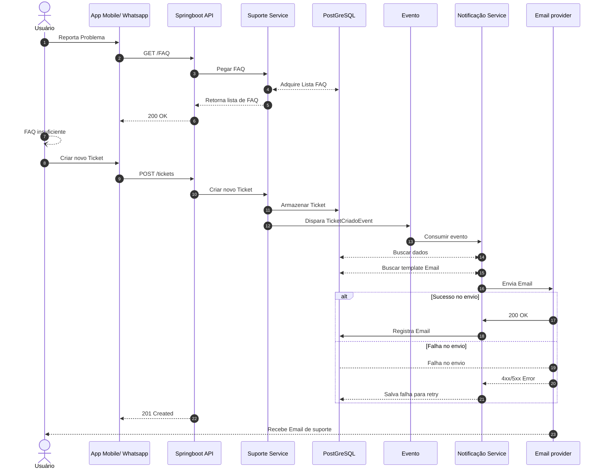

```mermaid


sequenceDiagram

    actor User as Usuário
    participant App as App Mobile/ Whatsapp
    participant API as Springboot API
    participant Suporte as Suporte Service
    participant Db as PostGreSQL 
    participant Event as Evento
    participant Noti as Notificação Service
    participant Email as Email provider

    autonumber

    User ->> App: Reporta Problema
    App ->> API: GET /FAQ
    API ->> Suporte: Pegar FAQ
    Suporte <<-->> Db: Adquire Lista FAQ
    Suporte -->> API: Retorna lista de FAQ
    API -->> App: 200 OK

    User --) User: FAQ insuficiente
    User ->> App: Criar novo Ticket
    App ->> API: POST /tickets
    API ->> Suporte: Criar novo Ticket
    Suporte ->> Db: Armazenar Ticket
    Suporte ->> Event: Dispara TicketCriadoEvent
    Event ->> Noti: Consumir evento
    Noti <<-->> Db: Buscar dados
    Noti <<-->> Db: Buscar template Email
    Noti ->> Email: Envia Email
    alt Sucesso no envio
    Email ->> Noti: 200 OK
    Noti ->> Db: Registra Email     
    else Falha no envio
    Email --> Db: Falha no envio
    Email -->> Noti: 4xx/5xx Error
    Noti -->> Db: Salva falha para retry
    end
    API -->> App: 201 Created
    Email -->> User: Recebe Email de suporte


```