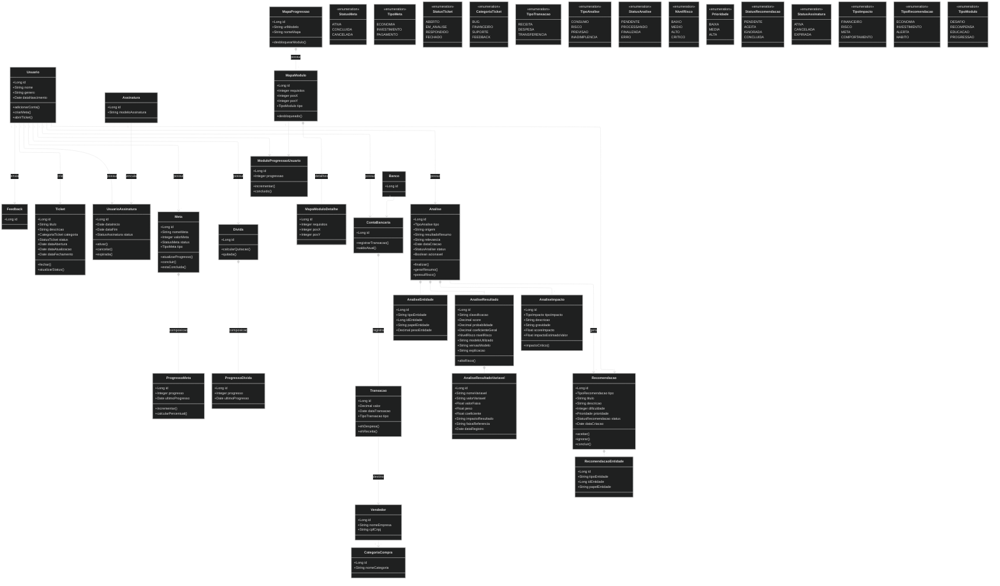

```mermaid

%%{init: {'theme':'dark', 'layout':'elk'}}%%
classDiagram
direction TB

%% =====================================================
%% USUARIO
%% =====================================================

class Usuario {
    +Long id
    +String nome
    +String genero
    +Date dataNascimento

    +adicionarConta()
    +criarMeta()
    +abrirTicket()
}

class Feedback {
    +Long id
}

class Ticket {
    +Long id
    +String titulo
    +String descricao
    +CategoriaTicket categoria
    +StatusTicket status
    +Date dataAbertura
    +Date dataAtualizacao
    +Date dataFechamento

    +fechar()
    +atualizarStatus()
}

class UsuarioAssinatura {
    +Long id
    +Date dataInicio
    +Date dataFim
    +StatusAssinatura status

    +ativar()
    +cancelar()
    +expirada()
}

class Assinatura {
    +Long id
    +String modeloAssinatura
}

Usuario "1" --> "*" Ticket : cria
Usuario "1" --> "*" Feedback : envia
Usuario "1" --> "*" UsuarioAssinatura : possui
Assinatura "1" --> "*" UsuarioAssinatura : vincula

%% =====================================================
%% PROGRESSAO
%% =====================================================

class Meta {
    +Long id
    +String nomeMeta
    +Integer valorMeta
    +StatusMeta status
    +TipoMeta tipo

    +atualizarProgresso()
    +concluir()
    +estaConcluida()
}

class ProgressoMeta {
    +Long id
    +Integer progresso
    +Date ultimoProgresso

    +incrementar()
    +calcularPercentual()
}

class Divida {
    +Long id

    +calcularQuitacao()
    +quitada()
}

class ProgressoDivida {
    +Long id
    +Integer progresso
    +Date ultimoProgresso
}

class MapaProgressao {
    +Long id
    +String urlModelo
    +String nomeMapa

    +desbloquearModulo()
}

class MapaModulo {
    +Long id
    +Integer requisitos
    +Integer posX
    +Integer posY
    +TipoModulo tipo

    +desbloqueado()
}

class MapaModuloDetalhe {
    +Long id
    +Integer requisitos
    +Integer posX
    +Integer posY
}

class ModuloProgressaoUsuario {
    +Long id
    +Integer progressao

    +incrementar()
    +concluido()
}

Usuario "1" --> "*" Meta : possui
Meta *-- ProgressoMeta : composicao

Usuario "1" --> "*" Divida : possui
Divida *-- ProgressoDivida : composicao

MapaProgressao *-- "*" MapaModulo : possui
MapaModulo *-- "*" MapaModuloDetalhe : detalhes

MapaModulo "1" --> "*" ModuloProgressaoUsuario
Usuario "1" --> "*" ModuloProgressaoUsuario

%% =====================================================
%% FINANCAS
%% =====================================================

class ContaBancaria {
    +Long id

    +registrarTransacao()
    +saldoAtual()
}

class Banco {
    +Long id
}

class Transacao {
    +Long id
    +Decimal valor
    +Date dataTransacao
    +TipoTransacao tipo

    +ehDespesa()
    +ehReceita()
}

class Vendedor {
    +Long id
    +String nomeEmpresa
    +String cpfCnpj
}

class CategoriaCompra {
    +Long id
    +String nomeCategoria
}

Usuario "1" --> "*" ContaBancaria : possui
Banco "1" --> "*" ContaBancaria

ContaBancaria *-- "*" Transacao : registra
Transacao --> Vendedor : destino

Vendedor "1" --> "*" CategoriaCompra

%% =====================================================
%% ANALISE
%% =====================================================

class Analise {
    +Long id
    +TipoAnalise tipo
    +String origem
    +String resultadoResumo
    +String relevancia
    +Date dataCriacao
    +StatusAnalise status
    +Boolean acionavel

    +finalizar()
    +gerarResumo()
    +possuiRisco()
}

class AnaliseEntidade {
    +Long id
    +String tipoEntidade
    +Long idEntidade
    +String papelEntidade
    +Decimal pesoEntidade
}

class AnaliseResultado {
    +Long id
    +String classificacao
    +Decimal score
    +Decimal probabilidade
    +Decimal coeficienteGeral
    +NivelRisco nivelRisco
    +String modeloUtilizado
    +String versaoModelo
    +String explicacao

    +altoRisco()
}

class AnaliseResultadoVariavel {
    +Long id
    +String nomeVariavel
    +String valorVariavel
    +Float valorFaixa
    +Float peso
    +Float coeficiente
    +String impactoResultado
    +String faixaReferencia
    +Date dataRegistro
}

class AnaliseImpacto {
    +Long id
    +TipoImpacto tipoImpacto
    +String descricao
    +String gravidade
    +Float scoreImpacto
    +Float impactoEstimadoValor

    +impactoCritico()
}

class Recomendacao {
    +Long id
    +TipoRecomendacao tipo
    +String titulo
    +String descricao
    +Integer dificuldade
    +Prioridade prioridade
    +StatusRecomendacao status
    +Date dataCriacao

    +aceitar()
    +ignorar()
    +concluir()
}

class RecomendacaoEntidade {
    +Long id
    +String tipoEntidade
    +Long idEntidade
    +String papelEntidade
}

Usuario "1" --> "*" Analise : possui

Analise *-- "*" AnaliseImpacto
Analise *-- "*" AnaliseEntidade
Analise *-- "1" AnaliseResultado

AnaliseResultado *-- "*" AnaliseResultadoVariavel

Analise --> "*" Recomendacao : gera

Usuario "1" --> "*" Recomendacao
Recomendacao *-- "*" RecomendacaoEntidade

%% =====================================================
%% ENUMS
%% =====================================================

class StatusMeta {
    <<enumeration>>
    ATIVA
    CONCLUIDA
    CANCELADA
}

class TipoMeta {
    <<enumeration>>
    ECONOMIA
    INVESTIMENTO
    PAGAMENTO
}

class StatusTicket {
    <<enumeration>>
    ABERTO
    EM_ANALISE
    RESPONDIDO
    FECHADO
}

class CategoriaTicket {
    <<enumeration>>
    BUG
    FINANCEIRO
    SUPORTE
    FEEDBACK
}

class TipoTransacao {
    <<enumeration>>
    RECEITA
    DESPESA
    TRANSFERENCIA
}

class TipoAnalise {
    <<enumeration>>
    CONSUMO
    RISCO
    PREVISAO
    INADIMPLENCIA
}

class StatusAnalise {
    <<enumeration>>
    PENDENTE
    PROCESSANDO
    FINALIZADA
    ERRO
}

class NivelRisco {
    <<enumeration>>
    BAIXO
    MEDIO
    ALTO
    CRITICO
}

class Prioridade {
    <<enumeration>>
    BAIXA
    MEDIA
    ALTA
}

class StatusRecomendacao {
    <<enumeration>>
    PENDENTE
    ACEITA
    IGNORADA
    CONCLUIDA
}

class StatusAssinatura {
    <<enumeration>>
    ATIVA
    CANCELADA
    EXPIRADA
}

class TipoImpacto {
    <<enumeration>>
    FINANCEIRO
    RISCO
    META
    COMPORTAMENTO
}

class TipoRecomendacao {
    <<enumeration>>
    ECONOMIA
    INVESTIMENTO
    ALERTA
    HABITO
}

class TipoModulo {
    <<enumeration>>
    DESAFIO
    RECOMPENSA
    EDUCACAO
    PROGRESSAO
}


```