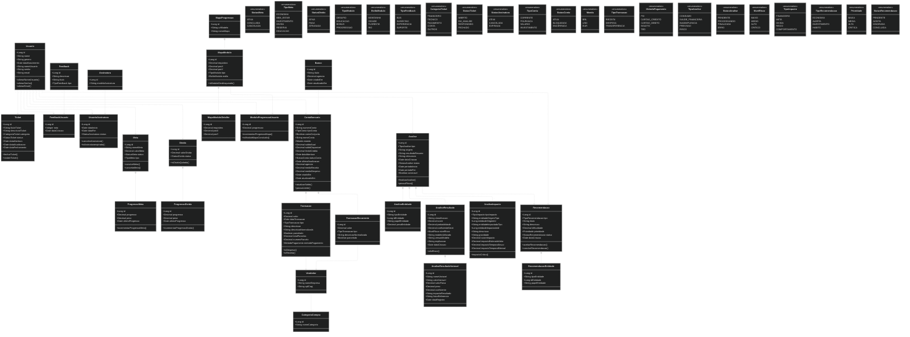

```mermaid
%%{init: {'theme':'dark', 'layout':'elk'}}%%
classDiagram
direction 

%% =====================================================
%% USUARIO
%% =====================================================

class Usuario {
    +Long id
    +String nome
    +String genero
    +Date dataNascimento
    +String nomeUsuario
    +String senha
    +String email

    +alterarNomeUsuario()
    +alterarSenha()
    +alterarEmail()
}

class Ticket {
    +Long id
    +String tituloTicket
    +String descricaoTicket
    +CategoriaTicket categoria
    +StatusTicket status
    +Date dataAbertura
    +Date dataAtualizacao
    +Date dataFechamento

    +fecharTicket()
    +reabrirTicket()
}

class Feedback {
    +Long id
    +String descricao
    +String titulo
    +TipoFeedback tipo
}

class FeedbackUsuario {
    +Long id
    +Integer nota
    +Date dataCriacao
}

class UsuarioAssinatura {
    +Long id
    +Date dataInicio
    +Date dataFim
    +StatusAssinatura status

    +cancelarAssinatura()
    +isAssinaturaexpirada()
}

class Assinatura {
    +Long id
    +String modeloAssinatura
}

Usuario "1" --> "*" Ticket
Usuario "1" --> "*" FeedbackUsuario
Feedback "1" --> "*" FeedbackUsuario

Usuario "1" --> "*" UsuarioAssinatura
Assinatura "1" --> "*" UsuarioAssinatura

%% =====================================================
%% PROGRESSAO
%% =====================================================

class Meta {
    +Long id
    +String nomeMeta
    +Decimal valorMeta
    +StatusMeta status
    +TipoMeta tipo

    +concluirMeta()
    +cancelarMeta()
}

class ProgressoMeta {
    +Long id
    +Decimal progresso
    +Decimal peso
    +Date ultimoProgresso

    +incrementarProgressoMeta()
}

class Divida {
    +Long id
    +Decimal valorDivida
    +StatusDivida status

    +isDividaQuitada()
}

class ProgressoDivida {
    +Long id
    +Decimal progresso
    +Decimal peso
    +Date ultimoProgresso

    +incrementarProgressoDivida()
}

class MapaProgressao {
    +Long id
    +String urlModelo
    +String nomeMapa
}

class MapaModulo {
    +Long id
    +Decimal requisitos
    +Decimal posX
    +Decimal posY
    +TipoModulo tipo
    +EstiloModulo estilo

    +isModuloDesbloqueado()
}

class MapaModuloDetalhe {
    +Long id
    +Decimal requisitos
    +Decimal posX
    +Decimal posY
}

class ModuloProgressaoUsuario {
    +Long id
    +Decimal progressao

    +incrementarProgressoMapa()
    +isModuloMapaConcluido()
}

Usuario "1" --> "*" Meta
Meta *-- ProgressoMeta

Usuario "1" --> "*" Divida
Divida *-- ProgressoDivida

MapaProgressao *-- "*" MapaModulo
MapaModulo *-- "*" MapaModuloDetalhe

MapaModulo "1" --> "*" ModuloProgressaoUsuario
Usuario "1" --> "*" ModuloProgressaoUsuario

%% =====================================================
%% FINANCAS
%% =====================================================

class Banco {
    +Long id
    +String titulo
    +Decimal agencia
    +Date criadoEm
    +Date atualizadoEm
}

class ContaBancaria {
    +Long id
    +String numeroConta
    +TipoConta tipoConta
    +Boolean contaConjunta
    +String nomeConta
    +Moeda moeda
    +Decimal saldoAtual
    +Decimal saldoDisponivel
    +Decimal limiteCredito
    +Date dataAbertura
    +StatusConta statusConta
    +Date ultimaAtualizacao
    +Decimal agencia
    +Decimal mediaReceita
    +Decimal mediaDespesa
    +Date criadoEm
    +Date atualizadoEm

    +atualizarSaldo()
    +possuiLimite()
}

class Transacao {
    +Long id
    +Decimal valor
    +Date dataTransacao
    +TipoTransacao tipo
    +String descricao
    +String descricaoNormalizada
    +Boolean parcelado
    +Decimal totalParcelas
    +Decimal numeroParcela
    +MetodoPagamento metodoPagamento

    +isDespesa()
    +isReceita()
}

class TransacaoRecorrente {
    +Long id
    +Decimal valor
    +TipoTransacao tipo
    +String descricaoNormalizada
    +Boolean parcelado
}

class Vendedor {
    +Long id
    +String nomeEmpresa
    +String cpfCnpj
}

class CategoriaCompra {
    +Long id
    +String nomeCategoria
}

Usuario "1" --> "*" ContaBancaria
Banco "1" --> "*" ContaBancaria

ContaBancaria *-- "*" Transacao
ContaBancaria *-- "*" TransacaoRecorrente

Transacao --> Vendedor
TransacaoRecorrente --> Vendedor

Vendedor "1" --> "*" CategoriaCompra

%% =====================================================
%% ANALISE
%% =====================================================

class Analise {
    +Long id
    +TipoAnalise tipo
    +String origem
    +String resultadoResumo
    +String relevancia
    +Date dataCriacao
    +StatusAnalise status
    +Date periodoInicio
    +Date periodoFim
    +Boolean acionavel

    +finalizarAnalise()
    +possuiRisco()
}

class AnaliseEntidade {
    +Long id
    +String tipoEntidade
    +Long idEntidade
    +String papelEntidade
    +Decimal pesoEntidade
}

class AnaliseResultado {
    +Long id
    +String classificacao
    +Decimal score
    +Decimal probabilidade
    +Decimal coeficienteGeral
    +NivelRisco nivelRisco
    +String modeloUtilizado
    +String versaoModelo
    +String explicacao
    +Date dataCriacao

    +altoRisco()
}

class AnaliseResultadoVariavel {
    +Long id
    +String nomeVariavel
    +String valorVariavel
    +Decimal valorFaixa
    +Decimal peso
    +Decimal coeficiente
    +String impactoResultado
    +String faixaReferencia
    +Date dataRegistro
}

class AnaliseImpacto {
    +Long id
    +TipoImpacto tipoImpacto
    +String entidadeOrigemTipo
    +Long entidadeOrigemId
    +String entidadeImpactadaTipo
    +Long entidadeImpactadaId
    +String descricao
    +String gravidade
    +Decimal scoreImpacto
    +Decimal impactoEstimadoValor
    +Decimal impactoTemporalAnual
    +Decimal impactoTemporalMensal

    +impactoCritico()
}

class Recomendacao {
    +Long id
    +TipoRecomendacao tipo
    +String titulo
    +String descricao
    +Decimal dificuldade
    +Prioridade prioridade
    +StatusRecomendacao status
    +Date dataCriacao

    +aceitarRecomendacao()
    +concluirRecomendacao()
}

class RecomendacaoEntidade {
    +Long id
    +String tipoEntidade
    +Long idEntidade
    +String papelEntidade
}

Usuario "1" --> "*" Analise

Analise *-- "*" AnaliseImpacto
Analise *-- "*" AnaliseEntidade
Analise *-- "1" AnaliseResultado

AnaliseResultado *-- "*" AnaliseResultadoVariavel

Analise --> "*" Recomendacao

Usuario "1" --> "*" Recomendacao
Recomendacao *-- "*" RecomendacaoEntidade

%% =====================================================
%% ENUMS
%% =====================================================

class StatusMeta {
    <<enumeration>>
    ATIVA
    CONCLUIDA
    CANCELADA
}

class TipoMeta {
    <<enumeration>>
    ECONOMIA
    BEM_ESTAR
    INVESTIMENTO
    DIVIDA
    RESERVA
    EDUCACAO
}

class StatusDivida {
    <<enumeration>>
    ATIVA
    PAGA
    ATRASADA
}

class TipoModulo {
    <<enumeration>>
    DESAFIO
    EDUCACAO
    BONUS
    PROGRESSAO
}

class EstiloModulo {
    <<enumeration>>
    MONTANHA
    CIDADE
    FLORESTA
    RIO
}

class TipoFeedback {
    <<enumeration>>
    BUG
    SUGESTAO
    EXPERIENCIA
    SUPORTE
}

class CategoriaTicket {
    <<enumeration>>
    FINANCEIRO
    TECNICO
    PAGAMENTO
    CONTA
    OUTROS
}

class StatusTicket {
    <<enumeration>>
    ABERTO
    EM_ANALISE
    RESPONDIDO
    FECHADO
}

class StatusAssinatura {
    <<enumeration>>
    ATIVA
    CANCELADA
    EXPIRADA
}

class TipoConta {
    <<enumeration>>
    CORRENTE
    POUPANCA
    SALARIO
    INVESTIMENTO
}

class StatusConta {
    <<enumeration>>
    ATIVA
    BLOQUEADA
    ENCERRADA
}

class Moeda {
    <<enumeration>>
    BRL
    USD
    EUR
}

class TipoTransacao {
    <<enumeration>>
    RECEITA
    DESPESA
    TRANSFERENCIA
}

class MetodoPagamento {
    <<enumeration>>
    PIX
    CARTAO_CREDITO
    CARTAO_DEBITO
    BOLETO
    TED
}

class TipoAnalise {
    <<enumeration>>
    CONSUMO
    SAUDE_FINANCEIRA
    INADIMPLENCIA
    PREVISAO
    RISCO
}

class StatusAnalise {
    <<enumeration>>
    PENDENTE
    PROCESSANDO
    FINALIZADA
    ERRO
}

class NivelRisco {
    <<enumeration>>
    BAIXO
    MEDIO
    ALTO
    CRITICO
}

class TipoImpacto {
    <<enumeration>>
    FINANCEIRO
    META
    DIVIDA
    RISCO
    COMPORTAMENTO
}

class TipoRecomendacao {
    <<enumeration>>
    ECONOMIA
    ALERTA
    INVESTIMENTO
    HABITO
}

class Prioridade {
    <<enumeration>>
    BAIXA
    MEDIA
    ALTA
    CRITICA
}

class StatusRecomendacao {
    <<enumeration>>
    PENDENTE
    ACEITA
    IGNORADA
    CONCLUIDA
}

```