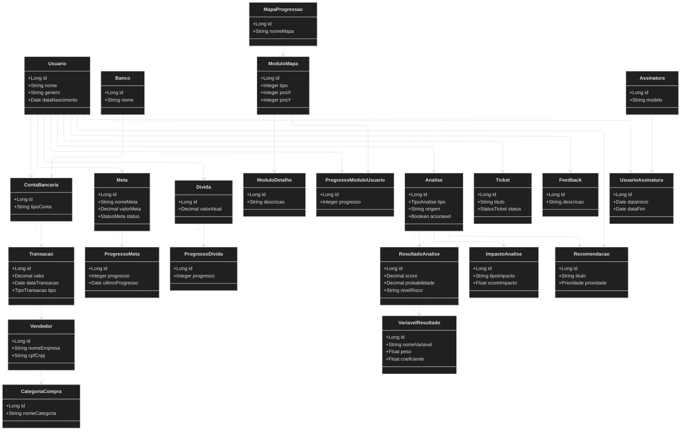

```mermaid
%%{init: {'theme':'dark', 'layout':'elk'}}%%

classDiagram
direction TB

%% =========================
%% USER DOMAIN
%% =========================

class Usuario {
    +Long id
    +String nome
    +String genero
    +Date dataNascimento
}

class ContaBancaria {
    +Long id
    +String tipoConta
}

class Banco {
    +Long id
    +String nome
}

class Transacao {
    +Long id
    +Decimal valor
    +Date dataTransacao
    +TipoTransacao tipo
}

class Vendedor {
    +Long id
    +String nomeEmpresa
    +String cpfCnpj
}

class CategoriaCompra {
    +Long id
    +String nomeCategoria
}

Usuario "1" --> "*" ContaBancaria
Banco "1" --> "*" ContaBancaria
ContaBancaria "1" --> "*" Transacao
Transacao "*" --> "1" Vendedor
Vendedor "1" --> "*" CategoriaCompra

%% =========================
%% GOALS DOMAIN
%% =========================

class Meta {
    +Long id
    +String nomeMeta
    +Decimal valorMeta
    +StatusMeta status
}

class ProgressoMeta {
    +Long id
    +Integer progresso
    +Date ultimoProgresso
}

Usuario "1" --> "*" Meta
Meta "1" --> "1" ProgressoMeta

%% =========================
%% DEBT DOMAIN
%% =========================

class Divida {
    +Long id
    +Decimal valorAtual
}

class ProgressoDivida {
    +Long id
    +Integer progresso
}

Usuario "1" --> "*" Divida
Divida "1" --> "1" ProgressoDivida

%% =========================
%% PROGRESSION DOMAIN
%% =========================

class MapaProgressao {
    +Long id
    +String nomeMapa
}

class ModuloMapa {
    +Long id
    +Integer tipo
    +Integer posX
    +Integer posY
}

class ModuloDetalhe {
    +Long id
    +String descricao
}

class ProgressoModuloUsuario {
    +Long id
    +Integer progresso
}

MapaProgressao "1" --> "*" ModuloMapa
ModuloMapa "1" --> "*" ModuloDetalhe
Usuario "1" --> "*" ProgressoModuloUsuario
ModuloMapa "1" --> "*" ProgressoModuloUsuario

%% =========================
%% ANALYTICS DOMAIN
%% =========================

class Analise {
    +Long id
    +TipoAnalise tipo
    +String origem
    +Boolean acionavel
}

class ResultadoAnalise {
    +Long id
    +Decimal score
    +Decimal probabilidade
    +String nivelRisco
}

class VariavelResultado {
    +Long id
    +String nomeVariavel
    +Float peso
    +Float coeficiente
}

class ImpactoAnalise {
    +Long id
    +String tipoImpacto
    +Float scoreImpacto
}

class Recomendacao {
    +Long id
    +String titulo
    +Prioridade prioridade
}

Usuario "1" --> "*" Analise
Analise "1" --> "1" ResultadoAnalise
ResultadoAnalise "1" --> "*" VariavelResultado
Analise "1" --> "*" ImpactoAnalise
Analise "1" --> "*" Recomendacao
Usuario "1" --> "*" Recomendacao

%% =========================
%% SUPPORT DOMAIN
%% =========================

class Ticket {
    +Long id
    +String titulo
    +StatusTicket status
}

class Feedback {
    +Long id
    +String descricao
}

Usuario "1" --> "*" Ticket
Usuario "1" --> "*" Feedback

%% =========================
%% SUBSCRIPTION DOMAIN
%% =========================

class Assinatura {
    +Long id
    +String modelo
}

class UsuarioAssinatura {
    +Long id
    +Date dataInicio
    +Date dataFim
}

Usuario "1" --> "*" UsuarioAssinatura
Assinatura "1" --> "*" UsuarioAssinatura

```